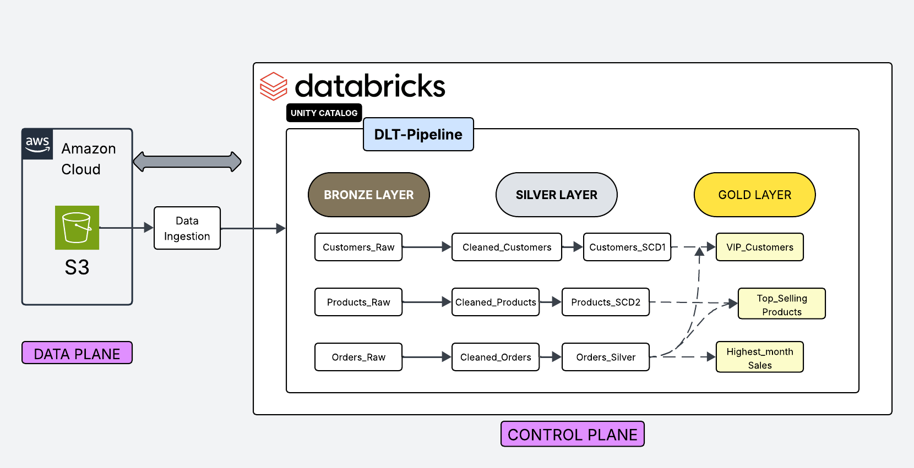
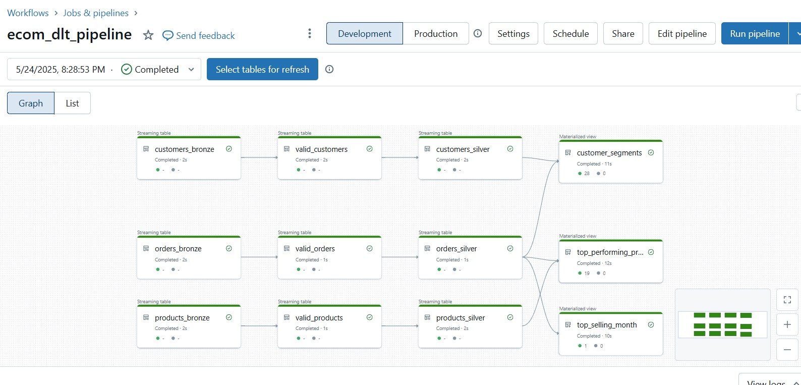
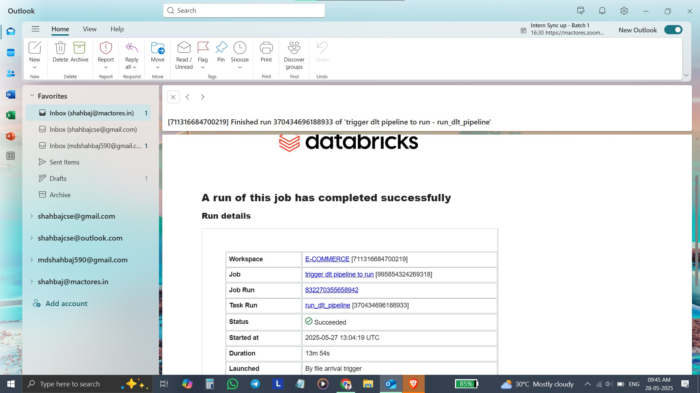

# E-commerce-DLT-Pipeline-with-SCD-Modeling

Hey there! I'm Md Shahbaj, and I'm obsessed with cracking e-commerce data puzzles. After diving into Databricks, I decided to build a full-fledged Delta Live Tables (DLT) ETL pipeline that processes daily sales, product, and customer data across all categories. This repo documents that journey.

---

## 📚 Table of Contents

1. [Architecture](-#-architecture)  
2. [Motivation](-#-motivation)  
3. [Business Logic Highlights](#-business-logic-highlights)  
4. [Project Phases](#-project-phases)  
5. [Resource Materials](-#-resource-materials)
6. [Key Learnings & Best Practices](-#-key-learning-&-best-practices)  

---

## 🏗️ Architecture

This diagram outlines the end-to-end flow of data through our Bronze, Silver, and Gold layers in Delta Live Tables, plus the automation and monitoring components.

---

## Motivation for this project

- **Data quality matters:** E-commerce data can be messy—missing values, frequent updates, inconsistent formats.  
- **Automation & scalability:** Daily loads shouldn’t require manual intervention. I wanted an idempotent, schedule-friendly pipeline.  
- **Hands-on with Databricks:** Unity Catalog, Autoloader, DLT, and Workflows are powerful. Time to put them through their paces.  

---

## 💡 Business Logic Highlights

- **Loyalty Scoring:** Rank customers via recency, frequency, and monetary value.  
- **New Customer Flagging:** Identify first-time buyers in the past week.  
- **Product Trends:** Rank by units sold, revenue, and track price changes.  
- **Monthly Analysis:** Compare month-over-month growth or decline.  

---

## 🚧 Project Phases

### Phase 1: Data Generation

- Used an AI chatbot (Grok) to generate realistic mock data for customers, products, and orders across multiple categories.  
- Ensured data quality rules (e.g., unique IDs, valid emails, plausible prices).  

### Phase 2: Databricks Setup

- Provisioned a premium Databricks workspace with Unity Catalog enabled.  
- Created a catalog `e_commerce` and database `ecom_db`.  
- Configured an external location to read raw files from S3 (`s3://ecom-data/`).  

### Phase 3: Pipeline Development

1. **Bronze Layer**  
   - Ingested raw JSON using Autoloader (idempotent, schema inference).

2. **Silver Layer**  
   - Cleaned data: removed rows missing critical fields (customer_name, email, product_id, price).  
   - Handled Slowly Changing Dimensions:  
     - Customers: **SCD Type 1** (overwrite with latest info).  
     - Products: **SCD Type 2** (track historical price changes).

3. **Gold Layer**  
   - Built analytical tables:  
     - Customer segmentation & loyalty insights.  
     - Top-selling products and inventory trends.  
     - Monthly sales performance & comparisons.

### Phase 4: Automation

- Deployed the DLT pipeline in **production mode** (clusters auto-terminate).  
- Scheduled via Databricks Workflows:  
  - Trigger on file arrival in S3 or at a fixed daily time.  
- Configured email alerts for pipeline success/failure.
    

---

## 🗂️ Resource Materials

- [**ecommerce_data.zip**](ecommerce_data.zip) — All raw customer, product, and order files.  
- [**SQL_script**](e_com_dlt_transformation.sql) — SQL script for DLT transformations.

---

## 🎓 Key Learnings & Best Practices

- **Data quality is king:** Always validate and clean data early in the pipeline to avoid garbage downstream.  
- **Idempotency matters:** Using Autoloader with Delta Live Tables ensures that data is processed exactly once — no duplicates!  
- **Slowly Changing Dimensions:** Understanding when to apply SCD Type 1 vs. Type 2 is crucial for accurate historical tracking.  
- **Modular pipeline design:** Breaking ETL into bronze, silver, and gold layers improves maintainability and clarity.  
- **Automation reduces errors:** Scheduling pipelines with Databricks Workflows and enabling notifications keeps things reliable and hands-off.  
- **Leverage Unity Catalog:** It simplifies governance, metadata management, and security in Databricks environments.  
- **Documentation & visualization:** Keeping architecture diagrams and SQL scripts organized helps both current understanding and future collaboration.  
- **Essential reference:** The [Databricks Delta Live Tables documentation](https://docs.databricks.com/workflows/delta-live-tables/index.html) was my go-to resource throughout the project.

---

### Hey! Thanks for checking out my project. I’d love to hear your thoughts, questions, or feedback — it really helps me improve.

If you’re working on a Databricks project like this or facing any challenges, don’t hesitate to reach out. I’m happy to help or just chat about data engineering!

- **Email:** [shahbajcse@gmail.com](mailto:shahbajcse@gmail.com)  
- **LinkedIn:** [https://www.linkedin.com/in/mdshahbaj](https://www.linkedin.com/in/mdshahbaj)
- **Medium:** [https://medium.com/@shahbajcse](https://medium.com/@shahbajcse)

Looking forward to connecting with you! 🚀

